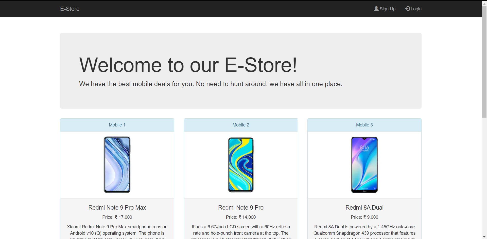
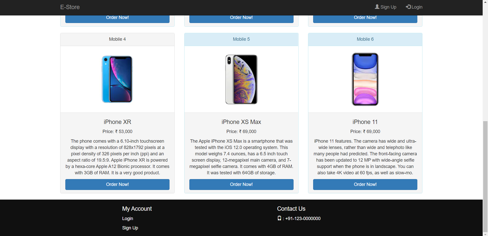
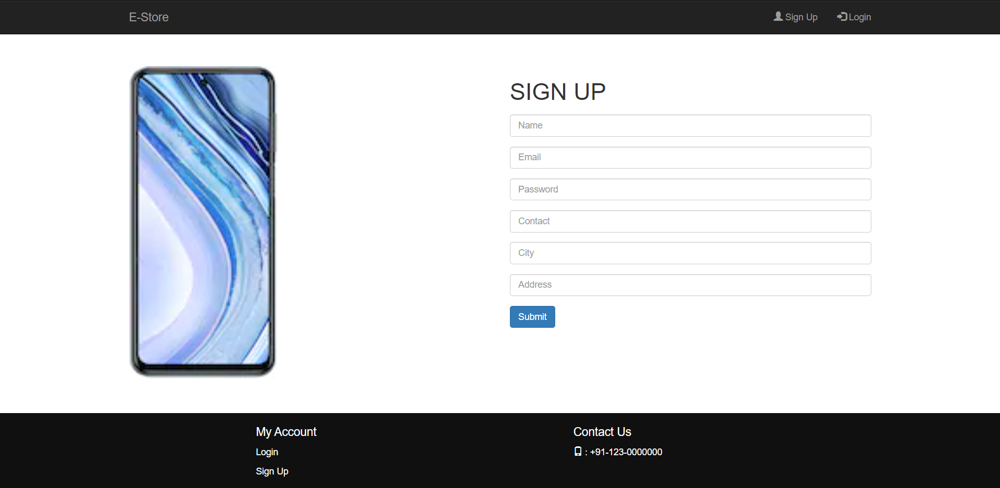
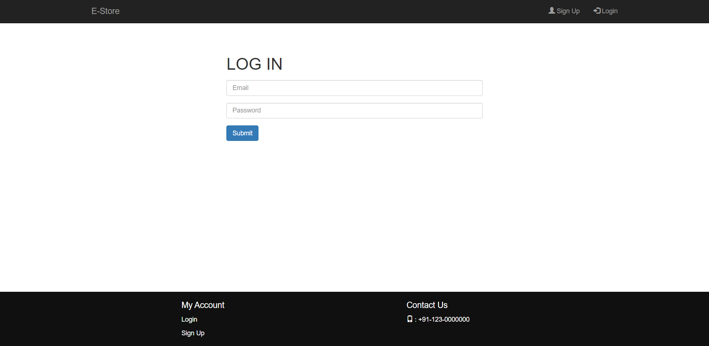
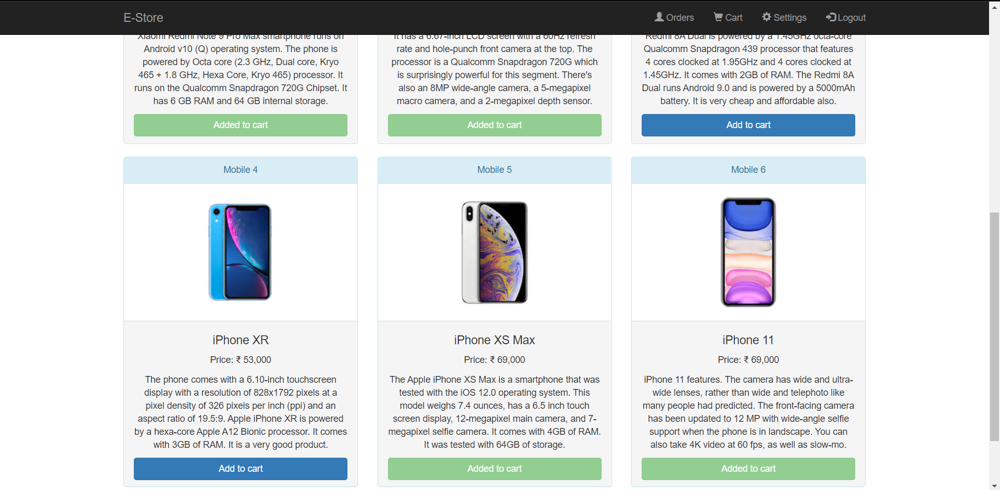
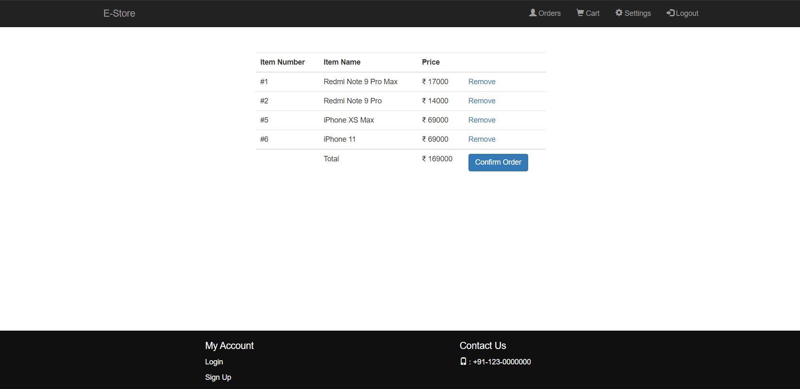
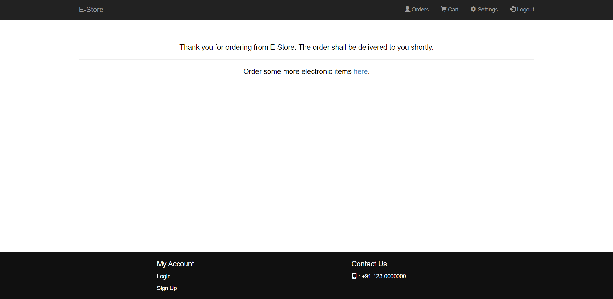
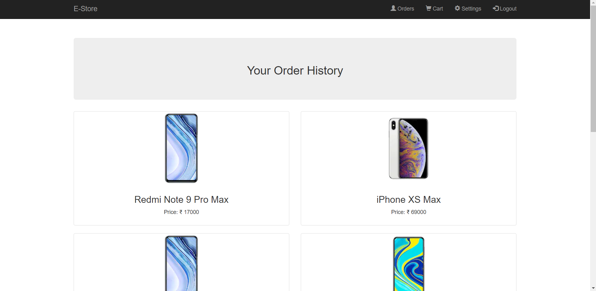
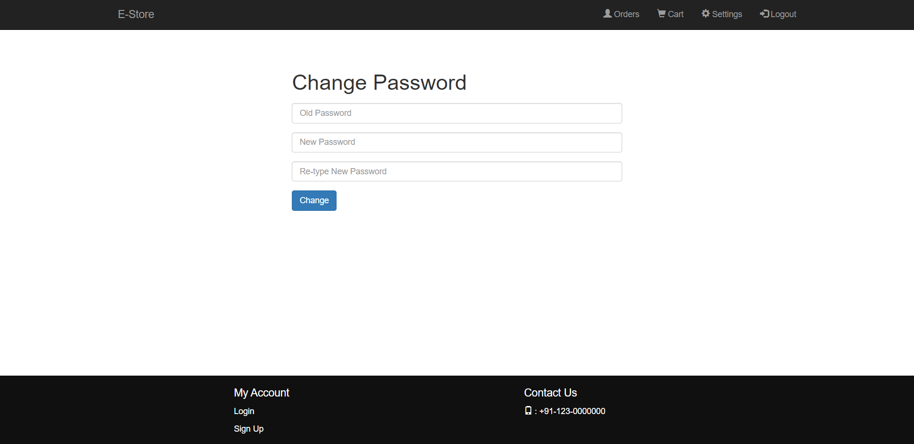

# Mobile E-Commerce Website.

Made using HTML, CSS, Bootstrap, MySQL and PHP

Import the ecommerce.sql file into your phpmyadmin and run at index.php.

<h3>Home Page</h3>

	

	

<h3>SignUp Page</h3>

	

<h3>Login Page</h3>

	

<h3>Adding products to cart</h3>

	

<h3>Cart Page</h3>

	

<h3>Cart Submit Page</h3>

	

<h3>Order History Page</h3>

	

<h3>Settings Page</h3>

	

